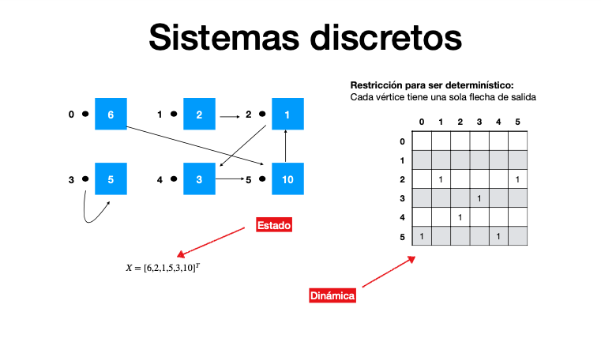
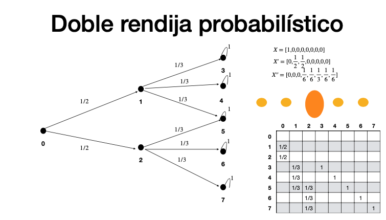
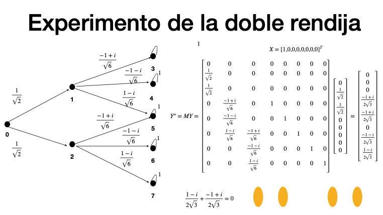

# Modelling Classical, Probabilistic, and Quantum Systems

Este repositorio contiene una serie de notebooks en Python para modelar sistemas físicos clásicos, probabilísticos y cuánticos. Los ejercicios exploran el comportamiento dinámico de estos sistemas utilizando matrices y vectores, así como simulaciones de experimentos físicos fundamentales.

## Contenido

### 1. Sistemas Clásicos Discretos



Se modela el comportamiento dinámico y el estado de un sistema clásico discreto utilizando matrices y vectores. El estado del sistema después de un paso se calcula mediante la multiplicación de una matriz de transición por un vector de estado.

### 2. Experimentos Probabilísticos y Cuánticos

#### Ejercicio 1: Modelo Probabilístico de la Doble Rendija

1. Implementar un programa en Python que modele el comportamiento del experimento probabilístico de la doble rendija.
2. Visualizar los resultados utilizando un diagrama de barras donde cada barra representa la intensidad de la luz en un objetivo específico.



#### Ejercicio 2: Modelo Cuántico de la Doble Rendija

1. Implementar un programa en Python que modele el comportamiento del experimento cuántico de la doble rendija.
2. Representar los resultados mediante un diagrama de barras que muestre la intensidad de la luz en cada punto de detección.



### 3. Simulación del Experimento de la Doble Rendija con Ondas

#### Objetivo

En este ejercicio, se simula el experimento de la doble rendija utilizando Python. En lugar de modelar la luz como partículas, se la representa como ondas y se observa el patrón de interferencia que surge cuando las ondas pasan por las rendijas y se superponen en la pantalla.

#### Antecedentes

El experimento de la doble rendija demuestra la dualidad onda-partícula de la luz y la materia. Cuando una luz coherente atraviesa dos rendijas cercanas, se genera un patrón de interferencia de franjas brillantes y oscuras en una pantalla de detección. Este patrón es el resultado de la interferencia constructiva y destructiva de las ondas que emergen de las rendijas.

#### Referencias

[Mathematics of Interference](https://phys.libretexts.org/Bookshelves/University_Physics/University_Physics_(OpenStax)/University_Physics_III_-_Optics_and_Modern_Physics_(OpenStax)/03%3A_Interference/3.03%3A_Mathematics_of_Interference)

#### Tarea

Se debe simular el patrón de interferencia de ondas en Python. Se asume que cada rendija actúa como una fuente puntual de ondas que se propagan en patrones circulares. Cuando estas ondas se superponen, interfieren entre sí y crean un patrón de intensidad alternante en la pantalla.

## Instalación y Uso

Para ejecutar los notebooks, sigue estos pasos:

1. Clona este repositorio:
   ```sh
   git clone https://github.com/brayanvaldes/doble-rendija.git
   ```
2. Accede al directorio del proyecto:
   ```sh
   cd doble-rendija
   ```
3. Instala las dependencias necesarias:
   ```sh
   pip install -r requirements.txt
   ```
4. Abre los notebooks en Jupyter Notebook o Jupyter Lab:
   ```sh
   jupyter notebook
   ```

## Autores

- **Brayan Valdes** - Desarrollo y documentación.

## Licencia

Este proyecto está bajo la licencia MIT. Consulta el archivo `LICENSE` para más detalles.

